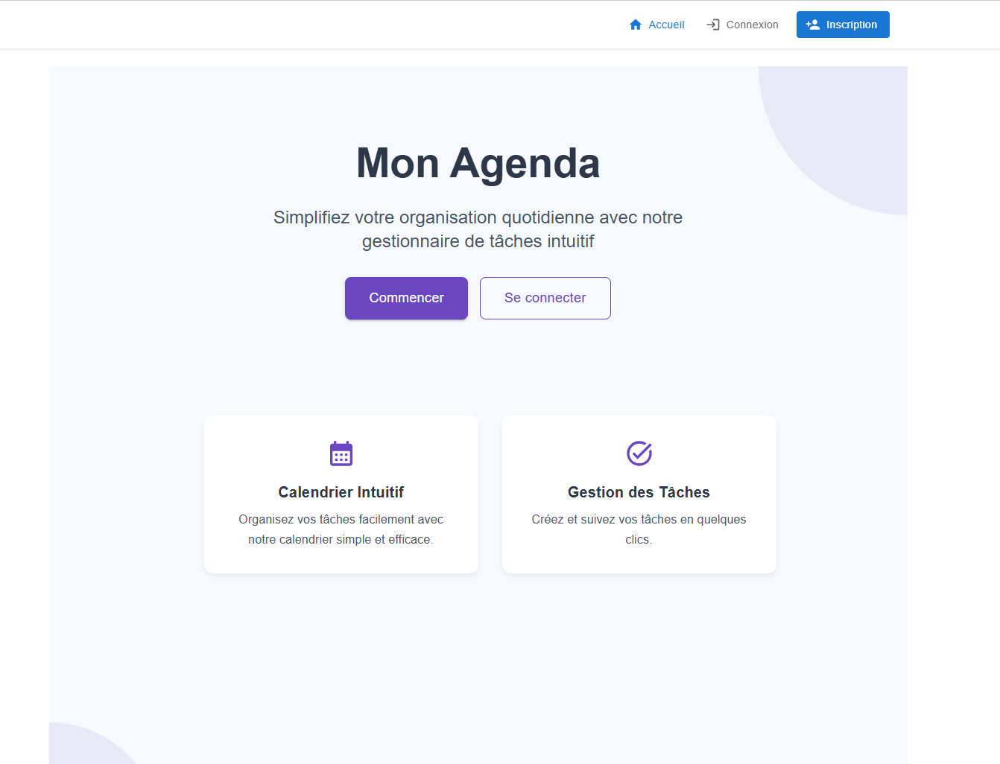
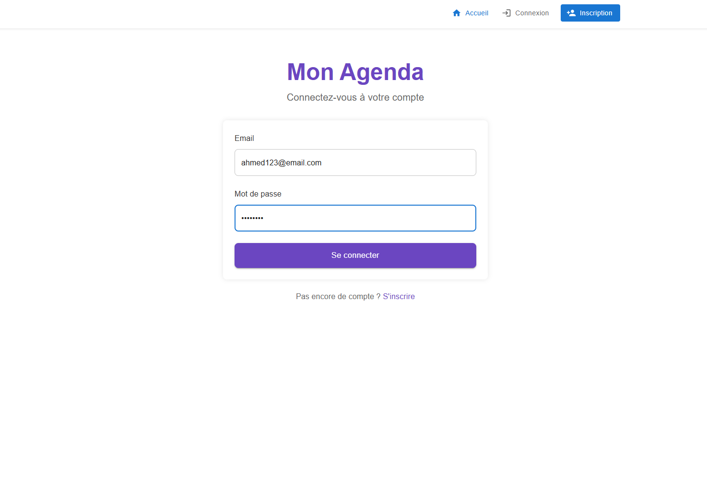
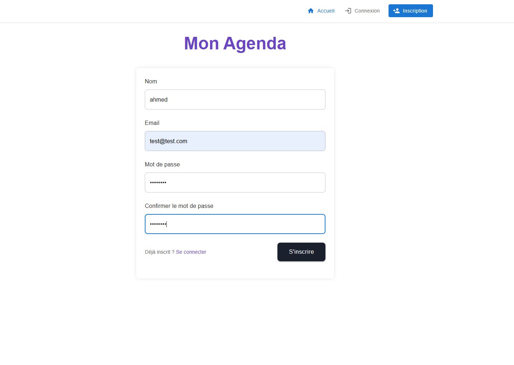
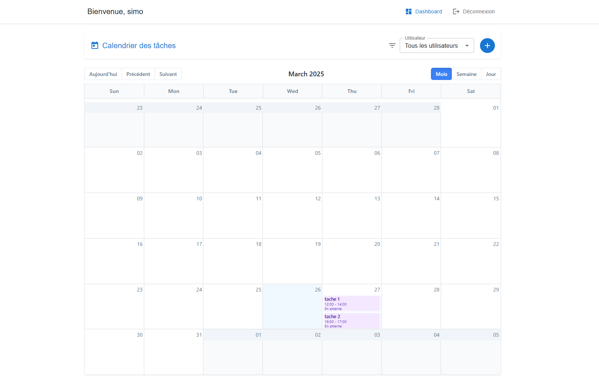
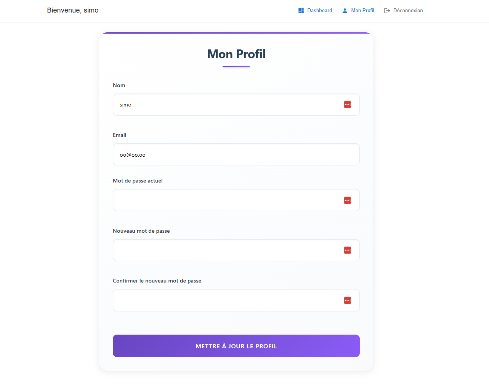

# TaskManager - Application de Gestion de Tâches

Une application web moderne de gestion de tâches développée avec Laravel et React, offrant une expérience utilisateur intuitive et des fonctionnalités avancées.

## 🚀 Fonctionnalités

- **Authentification sécurisée** avec JWT
- **Gestion des tâches** avec création, modification et suppression
- **Tableau de bord** interactif
- **Calendrier** intégré pour la visualisation des tâches
- **Profil utilisateur** personnalisable
- **Interface responsive** adaptée à tous les appareils
- **Système de notifications** en temps réel

## 🛠 Technologies Utilisées

### Backend
- Laravel
- PHP
- MySQL
- JWT pour l'authentification
- API RESTful

### Frontend
- React.js
- React Router
- Axios
- CSS3 avec animations
- Material-UI

## 📌 Prérequis
- PHP ≥ 8.0
- Composer
- MySQL
- Node.js & npm

## 📦 Installation et Configuration

1. **Cloner le repository**
```bash
git clone [URL_DU_REPO]
cd TaskManager
```

2. **Configuration du Backend**
```bash
cd Laravel
composer install
cp .env.example .env
php artisan key:generate
php artisan jwt:secret  # Important : Génère une nouvelle clé JWT
php artisan migrate
php artisan serve
```

3. **Configuration du Frontend**
```bash
cd reactjs
npm install
npm start
```

4. **Configuration de la Base de Données**
- Créer une base de données MySQL
- Configurer les informations de connexion dans le fichier `.env` du backend

### Exemple de configuration `.env`
```DB_CONNECTION=mysql
DB_HOST=127.0.0.1
DB_PORT=3306
DB_DATABASE=taskmanager
DB_USERNAME=root
DB_PASSWORD=

JWT_SECRET=your_generated_secret
```

## ⚠️ Note Importante sur JWT

À chaque nouveau clonage du projet, il est nécessaire de générer une nouvelle clé JWT avec la commande
`php artisan jwt:secret`. 
Cette étape est cruciale pour la sécurité de l'application car :
- La clé JWT est utilisée pour signer les tokens d'authentification
- Chaque environnement doit avoir sa propre clé unique
- Les clés JWT ne sont pas incluses dans le versionnement pour garantir la sécurité.

## 🔄 Mises à Jour 
✅ Dernières améliorations :
-  Nouvelle interface utilisateur moderne
-  Page de profil utilisateur améliorée
-  Ajout d’une page stylisée pour le backend
-  Système de filtrage des tâches
-  Diverses améliorations visuelles

##  Captures d'Écran

### Page d'Accueil


### Page de Connexion


### Page d'Inscription


### Tableau de Bord


### Page de Profil


## 📞 Contact

N’hésitez pas à nous contacter pour toute question ou collaboration !

## 👥 Développeurs

Ce projet a été développé avec passion par :
- **Hanae**
- **Ben Brahim**

---

© 2024 TaskManager. Tous droits réservés. 
